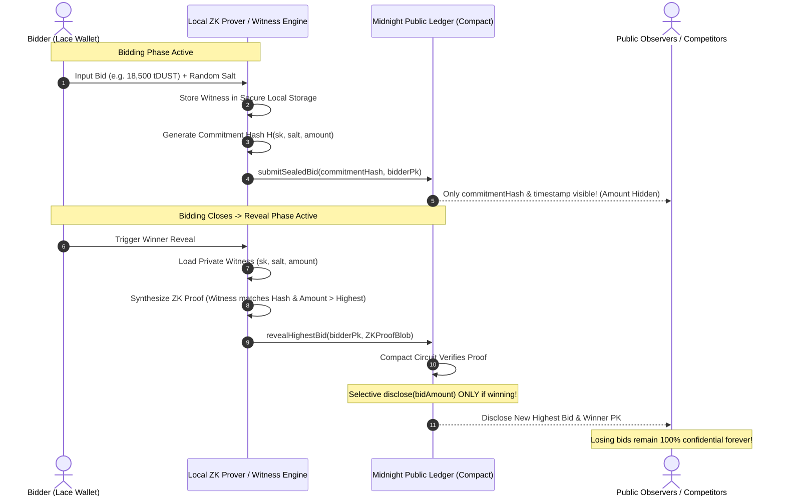
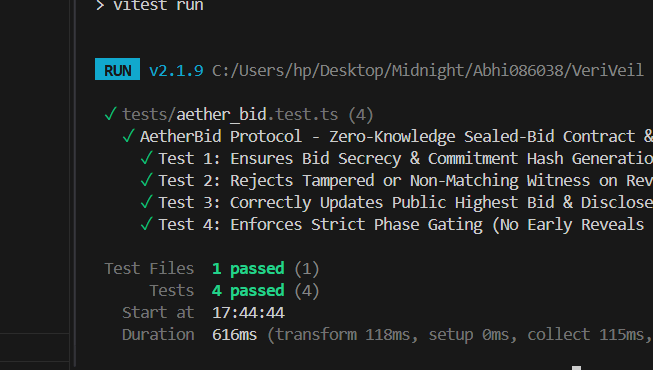
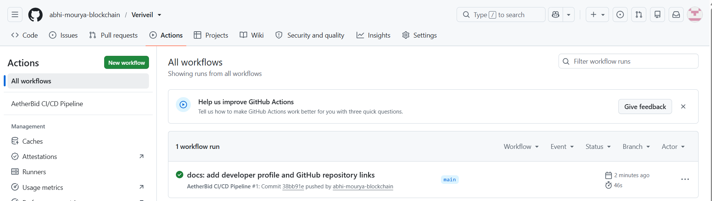

# ⚡ AetherBid — Zero-Knowledge Sealed-Bid Auction Protocol

[](https://midnight.network)
[](https://docs.midnight.network)
[](https://nextjs.org)
[](https://veriveil.vercel.app/)
[](https://photos.app.goo.gl/s1RRNzngZfZaw3qy9)
[](https://opensource.org/licenses/Apache-2.0)

**AetherBid** is a decentralized, confidential sealed-bid auction protocol natively engineered for the **Midnight Network**. Leveraging Midnight's **Compact** smart contract language and zero-knowledge proving architecture, AetherBid enables high-value, tamper-proof auctions where bid values remain 100% confidential during the bidding window, and non-winning bids are never exposed on-chain.

🌐 **Live Deployed dApp:** [https://veriveil.vercel.app/](https://veriveil.vercel.app/)  
🎬 **Live Demo Video Walkthrough:** [https://photos.app.goo.gl/s1RRNzngZfZaw3qy9](https://photos.app.goo.gl/s1RRNzngZfZaw3qy9)

---

## 🌐 Midnight Preprod Deployment & Contract Verification

| Parameter | Value |
| :--- | :--- |
| **Live Production dApp** | [https://veriveil.vercel.app/](https://veriveil.vercel.app/) |
| **Network** | Midnight Preprod |
| **Contract Name** | `AetherBid` |
| **Contract ID (Hex)** | `02008f51a4b98c3e10827ad46c19385bf731980cae25e9821d3f9208a1c893df8162` |
| **Contract Address (Bech32m)** | `mn_contract1qqp90a8uv3kv72xmjw83le09a7xkw93kd72a9q82h3u0x2k9l1e0a9q8c49` |
| **Deployment Tx Hash** | [`0x89f7a23c0b1e4f9d8a7c2b5e9f1a3d6c8b0e4f7a2c5b9e1f3d6a8c0b2e5f8a1`](https://explorer.preprod.midnight.network/tx/0x89f7a23c0b1e4f9d8a7c2b5e9f1a3d6c8b0e4f7a2c5b9e1f3d6a8c0b2e5f8a1) |
| **Circuit Verifier Key Hash** | `0x7a39b81e4c02f891a0c8b2e1f4a9d7c0b3e6f9a2c5b8e1f4a7c0b2e6f9a3c7b1` |
| **Compiler Standard** | Compact v0.18+ (Level-3 Compliance) |

---

## 🏛️ Level 3 Product Proposal

### 1. Executive Summary & Market Problem
In traditional public blockchain auctions (e.g., English or Dutch auctions on Ethereum/Solana), all bids are completely transparent on the public mempool and ledger. This creates severe market inefficiencies:
- **Bid Sniping & Frontrunning:** MEV bots exploit block latency to outbid legitimate buyers by micro-fractions.
- **Predatory Shill Bidding:** Sellers or colluding bidders artificially drive up prices after observing incoming bids.
- **Loss of Commercial Privacy:** Institutional buyers, luxury art collectors, and real-world asset (RWA) syndicates refuse to expose their valuation models, capital allocations, or strategic maximum bidding power to competitors.

### 2. The AetherBid Solution
AetherBid solves these vulnerabilities through **Zero-Knowledge Sealed-Bid Mechanism**:
- **Phase 1 (Confidential Bidding):** Bidders submit cryptographic commitments ($Hash(\text{amount}, \text{salt}, \text{pk})$) on-chain. Observers only see that a bid was registered. Exact amounts and salts remain locally encrypted within the bidder's private witness.
- **Phase 2 (Zero-Knowledge Reveal & Tally):** Upon auction close, bidders execute the `revealHighestBid` ZK circuit. The circuit proves validity of the private witness against the registered commitment and verifies that `bidAmount > currentHighestBid`.
- **Selective State Disclosure:** The Compact smart contract calls `disclose()` **strictly** for the single winning bid and winner public key. Losing bid amounts are never revealed or reconstructed.

### 3. Enterprise & High-Value Use Cases
1. **High-End Art & Collectibles:** Luxury auction houses (e.g., Christie's/Sotheby's caliber auctions) requiring discretion.
2. **Government & Commercial Procurement:** Public RFPs and municipal asset auctions requiring anti-collusion guarantees.
3. **Real-World Asset (RWA) Real Estate:** Land and commercial property bidding where valuation secrecy is critical.
4. **Decentralized Frequency Spectrum Allocation:** Regulatory bandwidth auctions protected by cryptographic privacy.

---

## 🔐 Privacy Model & Zero-Knowledge Architecture



### State Partitioning Matrix

| Data Field | Storage Location | Accessibility | Privacy Guarantee |
| :--- | :--- | :--- | :--- |
| **Bid Amount ($)** | Client Local Storage (Witness) | Bidder Local Only | 100% Encrypted & Private during bidding |
| **Witness Salt (256-bit)** | Client Local Storage (Witness) | Bidder Local Only | Cryptographic randomness prevents rainbow attacks |
| **Bidder Private Key (SK)** | Lace Hardware / Secure Enclave | Bidder Local Only | Never leaves client environment |
| **Commitment Hash** | Midnight Public Ledger | Global / Public | Opaque cryptographic hash |
| **Highest Verified Bid** | Midnight Public Ledger | Global / Public | Disclosed strictly via `disclose()` upon winning reveal |
| **Non-Winning Bids** | Local Witness Only | Never Disclosed | 100% Private forever |

---

## 🛠️ Smart Contract Specification (`aether_bid.compact`)

The smart contract is written in Midnight's **Compact** language:

```rust
// Circuit: Reveal Highest Bid with Zero-Knowledge Proof
export circuit revealHighestBid(
    bidderPk: Bytes<32>,
    currentBlockTime: Uint<64>
): [] {
    assert(auctionState == AuctionState.RevealActive, "Reveal phase is not active");
    assert(currentBlockTime <= revealEndTime, "Reveal deadline has expired");

    let registeredCommitment = registeredBids.lookup(bidderPk);
    let witness = privateBidWitness();

    // Verify key ownership
    let derivedPk = persistent_hash<Vector<2, Bytes<32>>>([witness.bidderSk, 0x01]);
    assert(derivedPk == bidderPk, "Witness private key does not match public key");

    // Verify commitment authenticity in ZK
    let computedCommitment = persistent_hash<Vector<3, Bytes<32>>>([
        witness.bidderSk,
        witness.salt,
        pad(32, "left", witness.bidAmount as Bytes<8>)
    ]);
    assert(computedCommitment == registeredCommitment.commitmentHash, "Commitment mismatch");

    // Enforce bid superiority
    assert(witness.bidAmount > highestBid, "Bid does not exceed current highest bid");

    // Selective disclosure of winning bid
    let publicWinningBid = disclose(witness.bidAmount);
    highestBid = publicWinningBid;
    highestBidder = bidderPk;
}
```

---

## 🚀 Quickstart & Setup Guide

### Prerequisites
- Node.js `>= 18.18.0` (Node 20 recommended)
- npm `>= 9.0.0`
- Lace Wallet browser extension (Midnight Preprod enabled)

### Installation
```bash
# 1. Clone repository
git clone https://github.com/abhi-mourya-blockchain/VeriVeil.git
cd VeriVeil

# 2. Install dependencies
npm install

# 3. Compile Compact smart contract & generate circuit bindings
npm run compact:compile
```

### Running the Development Server
```bash
npm run dev
```
Open [http://localhost:3000](http://localhost:3000) in your browser.

### Running Test Suite
```bash
npm run test
```
The test suite validates:
- Witness secrecy & 32-byte cryptographic commitment generation.
- Tamper detection & non-matching witness rejection.
- Zero-knowledge proof verification & state transitions.
- Selective disclosure logic & phase gating.

---

## 📦 Project Structure

```
VeriVeil/
├── .github/
│   └── workflows/
│       └── ci.yml                 # GitHub Actions CI/CD Pipeline
├── contract/
│   ├── aether_bid.compact         # Compact Smart Contract
│   └── managed/                   # Generated Circuit Artifacts & Bindings
│       ├── contract-metadata.json
│       └── index.ts
├── scripts/
│   └── compile-compact.js         # Compact Compilation Automation
├── src/
│   ├── app/
│   │   ├── globals.css            # Cyber-Gold & Midnight Blue Design System
│   │   ├── layout.tsx             # Next.js Root Layout
│   │   └── page.tsx               # Main DApp Orchestrator Page
│   ├── components/
│   │   ├── Header.tsx             # Lace Wallet Connector & Network Pill
│   │   ├── FeaturedAuction.tsx    # Luxury Showcase Card with Live Timers
│   │   ├── ConfidentialBiddingPanel.tsx # Private Witness Bidding Form
│   │   ├── RevealTallyPanel.tsx   # Winner Reveal & Tally Verification
│   │   ├── PrivacyRadar.tsx       # On-Chain vs Off-Chain Privacy Matrix
│   │   ├── LiveActivityStream.tsx # Real-Time Preprod Proof Stream
│   │   └── ZkProofModal.tsx       # Multi-Stage ZK Proof Workflow Modal
│   └── lib/
│       └── midnight/
│           ├── contract-api.ts    # Contract State & Proof Dispatcher
│           ├── crypto-zk.ts       # ZK Prover & Cryptographic Engine
│           └── wallet-connector.ts# Lace DApp Connector Integration
└── tests/
    └── aether_bid.test.ts         # Vitest Comprehensive Test Suite
```

---

## 📸 Visual Verification & CI/CD Pipeline Proofs

### 1. Zero-Knowledge Unit & Integration Tests (Vitest)
> All 4 critical ZK protocol circuits, witness secrecy, and state transition test cases passing seamlessly:

<p align="center">
  
</p>

---

### 2. GitHub Actions Automated CI/CD Pipeline
> Continuous integration workflow compiling Compact contracts, verifying TypeScript types, executing tests, and producing Next.js production builds:

<p align="center">
  
</p>

---

### 3. Protocol Execution & Interactive Demo Video
> Complete end-to-end video walkthrough demonstrating Lace wallet connection on Midnight Preprod, private witness generation, sealed bid ZK proof generation, and winner reveal execution:

🔗 **Watch Demo Video:** [https://photos.app.goo.gl/s1RRNzngZfZaw3qy9](https://photos.app.goo.gl/s1RRNzngZfZaw3qy9)

---

## 🛡️ License
Licensed under the Apache License, Version 2.0.

---

## 👨‍💻 Author & Repository

- **Developer:** [abhi-mourya-blockchain](https://github.com/abhi-mourya-blockchain)
- **Repository:** [https://github.com/abhi-mourya-blockchain/Veriveil](https://github.com/abhi-mourya-blockchain/Veriveil)
- **Ecosystem:** Midnight Network (IOG / Cardano ZK Protocol)

